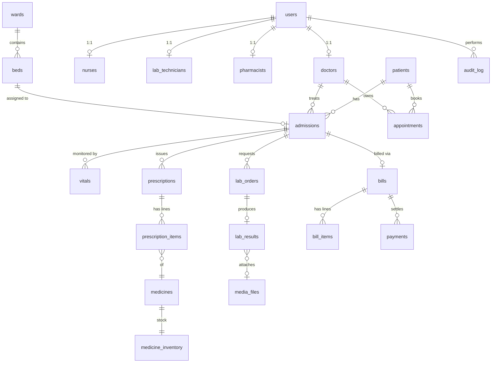

<div align="center">


# Hospify

### The operating system for modern healthcare

A full-stack, role-based **Hospital Management System** that unifies patient records, appointments, admissions, beds, pharmacy, lab, and billing into one secure workspace — built for the people running the hospital.

[](LICENSE)
[](https://react.dev/)
[](https://vite.dev/)
[](https://tailwindcss.com/)
[](https://flask.palletsprojects.com/)
[](https://www.postgresql.org/)
[](https://firebase.google.com/)
[](https://jwt.io/)

</div>

---

## Overview

**Hospify** is a DBMS course project (CS232 @ GIKI) built as a production-grade hospital management platform. The frontend is a bold-and-modern React SPA, the backend is a Flask REST API, and the data layer is a **fully normalized PostgreSQL** schema enriched with **views, triggers, stored procedures, functions, and indexes** — plus Firestore for real-time bed status sync.

```
┌─────────────────┐      JWT (HttpOnly)      ┌─────────────────┐      psycopg2       ┌─────────────────┐
│  React + Vite   │ ───────────────────────► │  Flask REST API │ ──────────────────► │   PostgreSQL    │
│  TanStack Query │ ◄─────────────────────── │   (blueprints)  │ ◄────────────────── │  21 tables · 3NF│
└────────┬────────┘                          └────────┬────────┘                     └─────────────────┘
         │                                            │
         │  onSnapshot (real-time)                    │  admin SDK
         ▼                                            ▼
┌────────────────────────────────────────────────────────────────┐
│                     Firebase Firestore                         │
│              (live bed status · cloud backup)                  │
└────────────────────────────────────────────────────────────────┘
```

---

## Table of Contents

- [Highlights](#-highlights)
- [Screenshots](#-screenshots)
- [Tech Stack](#-tech-stack)
- [Project Structure](#-project-structure)
- [Getting Started](#-getting-started)
- [Environment Variables](#-environment-variables)
- [User Roles & Demo Accounts](#-user-roles--demo-accounts)
- [Modules](#-modules)
- [Database Design](#-database-design)
- [Advanced DB Features](#-advanced-db-features)
- [API Reference](#-api-reference)
- [Testing & Quality](#-testing--quality)
- [Contributing](#-contributing)
- [License](#-license)

---

## Highlights

- **7 user roles** with row-level role guards on every endpoint (`super_admin`, `doctor`, `nurse`, `receptionist`, `pharmacist`, `lab_technician`, `billing_staff`).
- **21 PostgreSQL tables** in 3NF with FK-safe creation order.
- **5 views, 6 triggers, 3 stored procedures, 4 functions, 14 indexes** — heavy lifting lives in the database, not the app.
- **JWT auth in HttpOnly cookies** with a silent `/auth/refresh` interceptor on the frontend.
- **Real-time bed status** via Firestore `onSnapshot` — beds light up the second they change, no polling.
- **Cloud backup** — push & pull the entire relational dataset to/from Firestore from the Admin panel.
- **Bold-and-modern UI** — custom Tailwind 4 design system, Framer Motion micro-interactions, custom SVG hero, sparklines, occupancy rings, themed confirmation dialogs.
- **Server-driven alerts** — abnormal vitals and low-stock medicines automatically raise alerts via DB triggers, surfaced in the top-bar bell.
- **Centralized data layer** — every API call is wrapped in a custom `useXxx` React Query hook for caching, deduplication, and instant invalidation.

---

## Screenshots

> Add real screenshots to `docs/screenshots/` and they'll render here.

| | |
| :---: | :---: |
| **Login** — custom EKG hero | **Dashboard** — live stats + sparklines |
|  |  |
| **Beds** — occupancy ring + per-bed state | **Doctors** — per-doctor color identity |
|  |  |

---

## Tech Stack

### Frontend

| Layer | Choice |
| --- | --- |
| Framework | **React 19** + **Vite 8** |
| Styling | **Tailwind CSS 4** (custom design tokens, no component library) |
| Routing | **React Router 7** |
| Server state | **TanStack Query 5** |
| HTTP | **Axios** (custom instance · `withCredentials` · 401 → silent refresh) |
| Animation | **Framer Motion 12** |
| Charts | **Recharts 3** |
| Icons | **lucide-react** |
| Realtime | **Firebase Web SDK** (Firestore `onSnapshot`) |

### Backend

| Layer | Choice |
| --- | --- |
| Framework | **Flask 3** + Blueprints (12 modules) |
| Auth | **flask-jwt-extended** (HttpOnly cookies + refresh) |
| DB driver | **psycopg2-binary** (pooled connections) |
| Realtime / Storage | **firebase-admin** |
| PDF | **fpdf2** |
| Imaging | **Pillow** |
| Migrations | **Alembic** |
| AI assist (optional) | **google-generativeai** (Gemini) |

### Database

| Layer | Choice |
| --- | --- |
| RDBMS | **PostgreSQL 15+** |
| Schema | 21 tables · 3NF |
| Logic | 5 views · 6 triggers · 3 stored procedures · 4 functions · 14 indexes |
| Realtime mirror | **Firestore** (beds, alerts, cloud backup) |

---

## Project Structure

```
Hospify/
├── backend/
│   ├── app/
│   │   ├── __init__.py            # Flask app factory + blueprint wiring
│   │   ├── config.py              # env-driven config
│   │   ├── db.py                  # psycopg2 pool
│   │   ├── firebase.py            # firebase-admin init
│   │   ├── auth/                  # JWT login, refresh, /me, role middleware
│   │   ├── patients/              # CRUD + queries view
│   │   ├── doctors/               # doctors + appointments
│   │   ├── nurses/                # vitals + averages
│   │   ├── admissions/            # admit, discharge, list
│   │   ├── wards/                 # wards, beds, bed-status, busy-doctors report
│   │   ├── pharmacy/              # medicines, inventory, prescriptions
│   │   ├── lab/                   # lab orders + results
│   │   ├── billing/               # bills, line items, payments, summaries
│   │   ├── media/                 # file uploads (lab attachments)
│   │   ├── firebase_sync/         # cloud backup push/pull
│   │   └── admin/                 # users, audit log, alerts
│   ├── sql/
│   │   ├── schema.sql             # 21 tables, 3NF
│   │   ├── indexes.sql            # 14 indexes
│   │   ├── functions.sql          # 4 PL/pgSQL functions
│   │   ├── triggers.sql           # 6 triggers
│   │   ├── procedures.sql         # 3 stored procedures
│   │   └── views.sql              # 5 reporting views
│   ├── seed/
│   │   ├── seed_data.py           # populate demo data
│   │   └── media_generator.py     # generate sample lab PDFs/images
│   ├── apply_sql.py               # one-shot SQL bootstrap script
│   ├── run.py                     # Flask entry point
│   └── tests/                     # pytest smoke tests
│
├── frontend/
│   ├── src/
│   │   ├── api/axios.js           # custom Axios instance
│   │   ├── context/               # AuthContext
│   │   ├── hooks/                 # 12 React Query data hooks
│   │   ├── components/ui/         # Button, Card, Modal, Toast, Confirm…
│   │   ├── layouts/               # MainLayout, Sidebar, TopBar
│   │   ├── pages/                 # Dashboard, Patients, Appointments,
│   │   │                          # Admissions, Beds, Doctors, Pharmacy,
│   │   │                          # Lab, Billing, Admin, Login
│   │   ├── firebase.js            # Firebase web init
│   │   ├── App.jsx                # Router + ProtectedRoute
│   │   └── main.jsx               # QueryClient + providers
│   ├── public/
│   ├── index.html
│   ├── vite.config.js
│   └── package.json
│
├── requirements.txt               # Python deps
├── LICENSE                        # MIT
└── README.md                      # you are here
```

---

## Getting Started

### Prerequisites

| | |
| --- | --- |
| Python | **3.10+** |
| Node.js | **18+** (20 LTS recommended) |
| PostgreSQL | **15+** running locally or remotely |
| Firebase project | (optional but recommended for realtime + backup) |

### 1 — Clone

```bash
git clone https://github.com/AttaUrRahmanSheikh/Hospify-Hospital-Management-System-DBMS-CS232.git
cd Hospify-Hospital-Management-System-DBMS-CS232
```

### 2 — Backend setup

```bash
# create + activate virtual env
python -m venv .venv
.venv\Scripts\activate          # Windows PowerShell
# source .venv/bin/activate     # macOS / Linux

# install python deps
pip install -r requirements.txt 

# create the database (run inside psql)
createdb Hospify_DBMS

# copy the env template and edit values
cp .env.example .env            # or create .env manually (see next section)

# bootstrap schema, indexes, functions, triggers, procedures, views
python backend/apply_sql.py

# (optional) seed demo data
python backend/seed/seed_data.py

# run the API on http://localhost:5000
python backend/run.py
```

### 3 — Frontend setup

```bash
cd frontend
npm install
npm run dev            # http://localhost:5173
```

### 4 — Build for production

```bash
# frontend
cd frontend
npm run build          # outputs to frontend/dist

# backend (with gunicorn / uvicorn / waitress of your choice)
pip install gunicorn
gunicorn -b 0.0.0.0:5000 backend.run:app
```

---

## Environment Variables

Create a `.env` in the project root:

```ini
# ── Flask ───────────────────────────────────
SECRET_KEY=change-me
FLASK_ENV=development
FLASK_DEBUG=1
FLASK_PORT=5000

# ── JWT ─────────────────────────────────────
JWT_SECRET_KEY=jwt-change-me
JWT_ACCESS_TOKEN_EXPIRES=60          # minutes
JWT_REFRESH_TOKEN_EXPIRES=30         # days

# ── PostgreSQL ──────────────────────────────
DB_HOST=localhost
DB_PORT=5432
DB_NAME=Hospify_DBMS
DB_USER=postgres
DB_PASSWORD=your_password

# ── Firebase (optional) ─────────────────────
FIREBASE_CREDENTIALS_PATH=backend/serviceAccountKey.json
FIREBASE_PROJECT_ID=your-project-id
FIREBASE_STORAGE_BUCKET=your-project-id.appspot.com

# ── Gemini AI assist (optional) ─────────────
GEMINI_API_KEY=
GEMINI_MODEL=gemini-2.5-flash
```

And a `frontend/.env`:

```ini
VITE_API_BASE_URL=http://localhost:5000/api
VITE_FIREBASE_API_KEY=
VITE_FIREBASE_AUTH_DOMAIN=
VITE_FIREBASE_PROJECT_ID=
VITE_FIREBASE_STORAGE_BUCKET=
VITE_FIREBASE_MESSAGING_SENDER_ID=
VITE_FIREBASE_APP_ID=
```

---

## User Roles & Demo Accounts

After running `seed_data.py`, log in with any of these demo accounts (password for **all**: `Password123!`):

| Role | Email | Can do |
| --- | --- | --- |
| Super Admin | `admin@hospify.com` | Everything — user management, audit log, alerts, cloud backup |
| Doctor | `dr.khalid@hospify.com` | View schedule, write prescriptions, order labs, manage appointments |
| Nurse | `nurse.fatima@hospify.com` | Record vitals, view wards & admissions, update bed status |
| Receptionist | `receptionist@hospify.com` | Register patients, schedule appointments, admit patients |
| Pharmacist | `pharmacist@hospify.com` | Manage medicines, dispense prescriptions, restock inventory |
| Lab Technician | `lab.raza@hospify.com` | Process lab orders, upload results |
| Billing Staff | `billing@hospify.com` | Generate bills, record payments |

---

## Modules

Hospify is structured as **10 cohesive modules**, each backed by its own Flask blueprint:

| # | Module | Blueprint | Frontend Page |
| -: | --- | --- | --- |
| 1 | Authentication & User Management | `auth_bp`, `admin_bp` | Login, Admin |
| 2 | Patient Records | `patients_bp` | Patients |
| 3 | Doctors & Appointments | `doctors_bp` | Doctors, Appointments |
| 4 | Admissions & Bed Management | `admissions_bp`, `wards_bp` | Admissions, Beds |
| 5 | Vitals Monitoring | `nurses_bp` | inside Admissions |
| 6 | Pharmacy & Prescriptions | `pharmacy_bp` | Pharmacy |
| 7 | Lab Orders & Results | `lab_bp` | Lab |
| 8 | Billing & Payments | `billing_bp` | Billing |
| 9 | Audit, Alerts & Cloud Backup | `admin_bp`, `firebase_sync_bp` | Admin |
| 10 | Media / File Storage | `media_bp` | (Lab attachments) |

---

## Database Design

The schema is fully normalized to **3NF**, with FK-safe creation order. Identity (`users`) is separated from role-specific attributes (`doctors`, `nurses`, `lab_technicians`, `pharmacists`).



**21 tables** in total:

`users` · `patients` · `wards` · `beds` · `doctors` · `nurses` · `lab_technicians` · `pharmacists` · `admissions` · `appointments` · `vitals` · `medicines` · `medicine_inventory` · `prescriptions` · `prescription_items` · `media_files` · `lab_orders` · `lab_results` · `bills` · `bill_items` · `payments` · `alerts` · `audit_log`

---

## Advanced DB Features

A core requirement of CS232. Hospify pushes **business logic into the database** wherever transactional safety matters.

### Views (5)

| View | Purpose |
| --- | --- |
| `active_admissions_view` | Joins `admissions × patients × doctors × beds × wards`, exposes `patient_age` via `calculate_age()` |
| `doctor_schedule_today` | Per-doctor count of today's appointments by status (`FILTER` aggregates) |
| `pending_lab_orders_view` | Pending/in-progress orders ordered by priority (`stat → urgent → routine`) |
| `ward_occupancy_view` | Per-ward bed counts + occupancy % via `bed_occupancy_rate()` |
| `top_medicines_this_month` | Most prescribed medicines this calendar month with current stock |

### Triggers (6)

| Trigger | Fires on | What it does |
| --- | --- | --- |
| `trg_bed_on_assign` | `admissions` INSERT/UPDATE of `bed_id` | Marks bed as `occupied` |
| `trg_bed_on_discharge` | `admissions` UPDATE of `status` | Frees bed when patient is discharged |
| `trg_decrement_inventory` | `prescription_items` INSERT | Auto-decrements `medicine_inventory.quantity_available` |
| `trg_low_stock_alert` | `medicine_inventory` UPDATE | Inserts `low_stock` alert when below `reorder_level` |
| `trg_admission_audit` | `admissions` INSERT/UPDATE/DELETE | Writes JSONB before/after snapshot to `audit_log` |
| `trg_abnormal_vitals` | `vitals` INSERT | Raises `abnormal_vital` alerts for out-of-range temp / SpO₂ / pulse |

### Stored Procedures (3)

| Procedure | All-or-nothing |
| --- | --- |
| `admit_patient(patient_id, bed_id, doctor_id, type)` | Validates bed availability, creates admission, occupies bed, audits |
| `discharge_patient(admission_id, discharged_by)` | Sets discharge, frees bed, recomputes pending bill total, audits |
| `generate_bill(admission_id, generated_by)` | Computes bed-days × rate + lab × rate + Rx × rate, creates bill + line items, prevents duplicates |

### Functions (4)

| Function | Returns |
| --- | --- |
| `calculate_age(dob DATE)` | `INTEGER` — age in years (used in `active_admissions_view`) |
| `calculate_bill_total(admission_id)` | `NUMERIC` — sum of all `bill_items.total_price` for an admission |
| `bed_occupancy_rate(ward_id)` | `NUMERIC` — % of beds occupied (used in `ward_occupancy_view`) |
| `average_vital(admission_id, vital_name)` | `NUMERIC` — average of a named vital (whitelisted dynamic SQL) |

### Indexes (14)

Hot lookup paths: `patients.cnic`, `patients.full_name`, `admissions.status`, `admissions.patient_id`, `lab_orders.status`, `appointments.scheduled_at`, `medicines.generic_name`, `beds.status`, `users.email`, `bills.status`, `alerts.is_resolved`, `audit_log.user_id`, `vitals.admission_id`, `prescriptions.admission_id`.

---

## API Reference

All endpoints are prefixed with `/api`. Auth is JWT-in-HttpOnly-cookies; the frontend Axios instance silently refreshes on 401.

<details>
<summary><strong>Auth</strong> · <code>/api/auth</code></summary>

| Method | Path | Body | Roles |
| --- | --- | --- | --- |
| POST | `/login` | `{ email, password }` | public |
| POST | `/logout` | — | any |
| POST | `/refresh` | — | any (refresh cookie) |
| GET | `/me` | — | any |
</details>

<details>
<summary><strong>Patients</strong> · <code>/api/patients</code></summary>

| Method | Path | Roles |
| --- | --- | --- |
| GET | `/` | any |
| GET | `/:id` | any |
| POST | `/` | super_admin, receptionist |
| PUT | `/:id` | super_admin, receptionist |
| DELETE | `/:id` | super_admin |
| GET | `/reports/frequent-admissions` | super_admin, doctor |
</details>

<details>
<summary><strong>Doctors & Appointments</strong> · <code>/api/doctors</code></summary>

| Method | Path | Roles |
| --- | --- | --- |
| GET | `/` | any |
| GET | `/:id` | any |
| GET | `/:id/schedule` | any |
| GET | `/appointments/all` | any |
| GET | `/:id/appointments` | any |
| POST | `/appointments` | super_admin, receptionist |
| PATCH | `/appointments/:id/status` | super_admin, receptionist, doctor |
</details>

<details>
<summary><strong>Wards & Beds</strong> · <code>/api/wards</code></summary>

| Method | Path | Roles |
| --- | --- | --- |
| GET | `/` | any |
| POST | `/` | super_admin |
| GET | `/:id/beds` | any |
| POST | `/:id/beds` | super_admin |
| GET | `/beds/available` | any |
| PATCH | `/beds/:id/status` | super_admin, receptionist, nurse |
| GET | `/reports/busy-doctors` | super_admin, doctor |
</details>

<details>
<summary><strong>Admissions</strong> · <code>/api/admissions</code></summary>

| Method | Path | Roles |
| --- | --- | --- |
| GET | `/` | any |
| POST | `/admit` | super_admin, receptionist, doctor |
| POST | `/:id/discharge` | super_admin, doctor |
</details>

<details>
<summary><strong>Nurses · Vitals</strong> · <code>/api/nurses</code></summary>

| Method | Path | Roles |
| --- | --- | --- |
| GET | `/vitals/:admission_id` | any |
| GET | `/vitals/:admission_id/averages` | any |
| POST | `/vitals` | super_admin, nurse |
</details>

<details>
<summary><strong>Pharmacy</strong> · <code>/api/pharmacy</code></summary>

| Method | Path | Roles |
| --- | --- | --- |
| GET | `/medicines` | any |
| GET | `/inventory/low-stock` | any |
| GET | `/top-medicines` | any |
| PATCH | `/inventory/:id` | super_admin, pharmacist |
| GET | `/prescriptions/:admission_id` | any |
</details>

<details>
<summary><strong>Lab</strong> · <code>/api/lab</code></summary>

| Method | Path | Roles |
| --- | --- | --- |
| GET | `/orders/all` | any |
| PATCH | `/orders/:id/status` | super_admin, lab_technician, doctor |
| GET | `/orders/:id/result` | any |
</details>

<details>
<summary><strong>Billing</strong> · <code>/api/billing</code></summary>

| Method | Path | Roles |
| --- | --- | --- |
| GET | `/` | any |
| GET | `/:admission_id` | any |
| GET | `/summary/:bill_id` | any |
| POST | `/generate/:admission_id` | super_admin, billing_staff |
| POST | `/:bill_id/pay` | super_admin, billing_staff, receptionist |
</details>

<details>
<summary><strong>Admin</strong> · <code>/api/admin</code></summary>

| Method | Path | Roles |
| --- | --- | --- |
| GET | `/users` | super_admin |
| POST | `/users` | super_admin |
| PATCH | `/users/:id/status` | super_admin |
| GET | `/audit-log` | super_admin |
| GET | `/alerts` | super_admin, nurse, pharmacist |
| PATCH | `/alerts/:id/resolve` | super_admin, nurse, pharmacist |
| POST | `/backup/push` | super_admin |
| POST | `/backup/pull` | super_admin |
</details>

---

## Testing & Quality

```bash
# backend smoke tests
pytest backend/tests

# frontend lint (ESLint 10 + react-hooks 7)
cd frontend && npm run lint

# frontend production build (vite + Tailwind 4)
cd frontend && npm run build
```

Quality checks already wired into the codebase:

- ESLint with `react-hooks` and `react-refresh` plugins (zero warnings on `main`).
- Strict role guards on every mutating endpoint (`@roles_required(...)`).
- All-or-nothing transactional procedures for admit/discharge/billing.
- Generated columns + DB-side validation (`CHECK` constraints) so the API can't write invalid state.

---

## Contributing

1. Fork the repo and create a feature branch (`git checkout -b feat/your-feature`).
2. Run `npm run lint` and `pytest` before pushing.
3. Open a pull request describing the change and the tables/endpoints it touches.

---

## License

[MIT](LICENSE) © 2026 [Atta Ur Rahman Sheikh](https://github.com/AttaUrRahmanSheikh)

---

<div align="center">

Built for **CS232 — Database Management Systems** at **GIKI** &middot; Spring 2026

<sub>If this project helped, consider giving it a ⭐ on GitHub.</sub>

</div>
